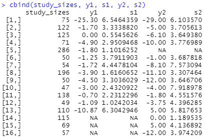
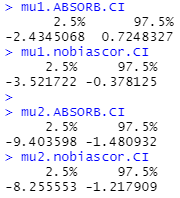
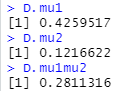
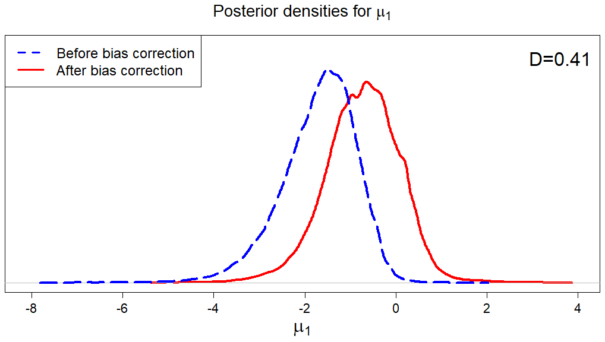
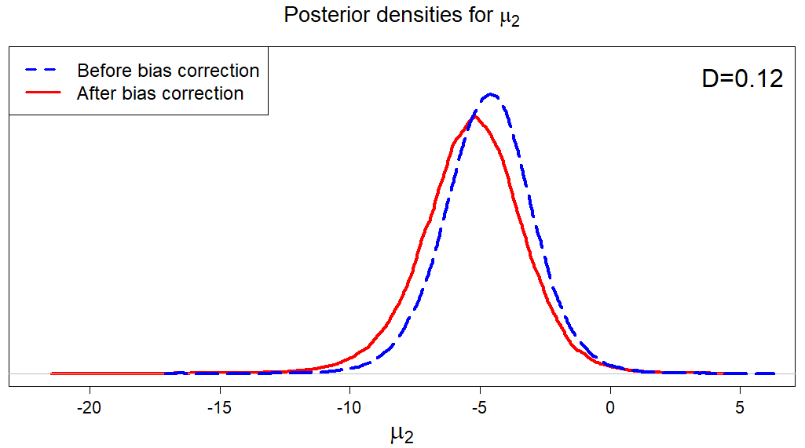
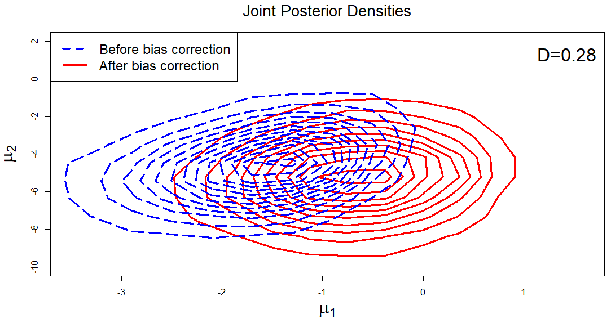

# ABSORB
R package for implementing A Bayesian Selection model for correcting Outcome Reporting Bias (ABSORB)

This is an R package to implement the models in the paper, "A Bayesian selection model for correcting outcome reporting bias with application to a meta-analysis on heart failure interventions" by Ray Bai, Xiaokang Liu, Lifeng Lin, Yulun Liu, Stephen E. Kimmel, Haitao Chu, and Yong Chen (pre-print, 2021+).  

The ABSORB model adjusts for potential outcome reporting bias (ORB) in multivariate meta-analysis (MMA). The non-bias corrected model fits a Bayesian model for MMA with missing outcomes without adjusting for ORB. The D measure computes the Hellinger distance between the bias-corrected (ABSORB) model and the non-bias corrected posterior densities, thereby quantifying the impact of ORB on the results from the MMA.

Note that in order to get this code to work, you need to have the most recent version of JAGS (Version 4.3.0) installed on your computer. You may install JAGS-4.x.y.exe from
http://www.sourceforge.net/projects/mcmc-jags/files. Then in R, make sure that R is properly directed to the folder where JAGS-4.3.0 is installed. For example, if JAGS-4.3.0 is saved to your Program Files, you can set the environment variable as follows.

```
# Edit the location where you have saved JAGS-4.3.0 on your local machine 
Sys.setenv(JAGS_HOME="C:/Program Files/JAGS/JAGS-4.3.0")
```

Now, use the following R code to install and load the ABSORB package. 

```
# Install and load ABSORB package
library(devtools)
install_github(repo = "raybai07/ABSORB")
library(ABSORB)
``` 

There are three main functions in this package, which we will demonstrate how to use below:

+ `ABSORB` - This function fits the ABSORB model of Bai et al. (2021+). The function accepts the arguments: study sizes (`study_sizes'), first outcome (`y1`), standard errors for the first outcome (`s1`), second outcome (`y2`), and standard errors for the second outcome (`s2`). Note that either (`y1`, `s1`) or (`y2`, `s2`) may be missing. Missing outcomes should be denoted by `NA`.  

+ `BayesNonBiasCorrected` - This function fits the non-bias corrected model of Bai et al. (2021+). This function accepts the arguments: first outcome (`y1`), standard errors for the first outcome (`s1`), second outcome (`y2`), and standard errors for the second outcome (`s2`). Note that either (`y1`, `s1`) or (`y2`, `s2`) may be missing. Missing outcomes should be denoted by `NA`. 

+ `D_ORB` - This function computes the D measure of Bai et al. (2021+). The function arguments should be the MCMC samples obtained from fitting the ABSORB model and the MCMC samples obtained from fitting the non-bias corrected model. Values of D close to 0 indicate more negligible impact from ORB, while values close to 1 indicate more severe impact from ORB.

To illustrate the use of this package, we use a real data set of 16 studies from the Cochrane Database of Systematic Reviews. This meta-analysis concerns the effects of exercise therapy for treatment of lower back pain. The outcomes are the mean difference (MD) for function measure (`y1`) and pain measure (`y2`) between the intervention and control groups, and we want to estimate the population treatment effect of exercise therapy for function measure (`mu1`) and pain measure (`mu2`) respectively. This data can be obtained from Cochrane Database ID:CD000335 (DOI: 10.1002/14651858.CD000335.pub2), but we reproduce it below for the sake of illustration.

```{r, eval=FALSE}
# Real data from an MMA on the effects of exercise therapy on lower back pain

y1 <- c(-25.30, -1.70, 0.00, -4.90, -1.80, -1.25, -1.72, -3.90, -4.50, 
        -3.00, -0.70, -1.09, -10.87, NA, NA, NA)
s1 <- c(6.5464359, 3.3338820, 0.5545626, 2.9509468, 1.1016252, 3.7911903, 
        4.4478104, 1.6160652, 3.3036029, 2.4320922, 2.2312296, 1.0242034, 
        6.3042946, NA, NA, NA)
y2 <- c(-29.00, -5.00, -6.10, -10.00, NA, -1.00, -8.10, -11.100, -12.00,
        -4.00, -1.80, -3.75, 5.00, 0.00, 5.00, -12.00)
s2 <- c(6.103570, 3.705613, 3.649380, 3.776989, NA, 3.687818, 7.573094,
        3.307464, 3.646706, 7.918978, 4.551576, 4.396285, 5.817653, 1.189535,
        4.136892, 3.974209)
study_sizes <- c(75, 122, 125, 71, 286, 50, 54, 196, 50, 47, 138,
                 49, 110, 115, 69, 57)
```

Of the 16 studies in this meta-analysis, we see that 3 studies do not report the first endpoint or its standard error (y1, s1) and 1 study does not report the second endpoint or its standard error (y2, s2). 



We now fit the ABSORB model and the non-bias corrected models using the `ABSORB` and `BayesNonBiasCorrected` functions. Note that the study sizes are only needed for the ABSORB model, not for the non-bias corrected model. In addition, the user has to specify a `seed` if he or she wants to reproduce the exact same results from their analysis. The default number of burn-in samples (`burn`) is 10,000 and the default number of total MCMC draws (`nmc`) is 50,000. However, the user can change these values if more or fewer iterations are necessary for convergence.

```{r, eval=FALSE}
# Fit ABSORB model
absorb.mod <- ABSORB(study_sizes, y1, s1, y2, s2, seed=12345,
                     burn=10000, nmc=50000)

# Fit non-bias corrected model
nobias.mod <- BayesNonBiasCorrected(y1, s1, y2, s2, seed=12345,
                                    burn=10000, nmc=50000)

```

Having fit these models, we can now obtain the point estimates for the model parameters, denoted by `[parameter].hat`. We can also use the MCMC samples of the model parameters (denoted by `[parameter].samples`) to obtain 95 percent posterior credible intervals and other summary statistics or to plot the posterior densities. Below, we obtain the posterior means for the population treatment effects (`mu1.hat`, `mu2.hat`) and the between-study heterogeneity parameters (`tau1.hat`, `tau2.hat`), as well as the 95 percent posterior credible intervals for `mu1` and `mu2` using `mu1.samples` and `mu2.samples`.

```{r, eval=FALSE}
# Point estimates for (mu1, mu2, tau1, tau2) in ABSORB (bias-corrected) model
absorb.mod$mu1.hat
absorb.mod$mu2.hat
absorb.mod$tau1.hat
absorb.mod$tau2.hat

# Point estimates for (mu1, mu2, tau1, tau2) in non-bias corrected model
nobias.mod$mu1.hat
nobias.mod$mu2.hat 
nobias.mod$tau1.hat
nobias.mod$tau2.hat

# 95 percent credible intervals for mu1
mu1.ABSORB.CI <- quantile(absorb.mod$mu1.samples, probs=c(0.025,0.975))
mu1.nobiascor.CI <- quantile(nobias.mod$mu1.samples, probs=c(0.025,0.975))

mu1.ABSORB.CI
mu1.nobiascor.CI

# 95 percent credible intervals for mu2
mu2.ABSORB.CI <- quantile(absorb.mod$mu2.samples, probs=c(0.025,0.975))
mu2.nobiascor.CI <- quantile(nobias.mod$mu2.samples, probs=c(0.025,0.975))

mu2.ABSORB.CI
mu2.nobiascor.CI
```


In particular, we see that there is a change in the statistical significance for `mu1` (function measure). The 95 percent posterior credible interval for `mu1` changes from (-3.52, -0.38) under the non-bias corrected model to (-2.43, 0.72) under the ABSORB model. This indicates that after adjusting for ORB, the mean effect of exercise therapy on function measure is no longer statistically significant.

We can also compute the D measure for `mu1`, `mu2`, or `(mu1, mu2)` jointly using the function `D_ORB`. The D measure quantifies the impact of ORB by calculating the Hellinger distance between the bias-corrected and non-bias corrected posteriors. The D measure lies between 0 and 1, with values close to 0 indicating less impact from ORB and values close to 1 indicating more severe impact from ORB.

```{r, eval=FALSE}
# Compute D measure for first outcome
D.mu1 <- D_ORB(absorb.mod$mu1.samples, nobias.mod$mu1.samples)

# Compute D measure for second outcome
D.mu2 <- D_ORB(absorb.mod$mu2.samples, nobias.mod$mu2.samples)

# Compute D measure for first and second endpoints jointly
D.mu1mu2 <- D_ORB(cbind(absorb.mod$mu1.samples, absorb.mod$mu2.samples), 
                  cbind(nobias.mod$mu1.samples, nobias.mod$mu2.samples))

```


We see that the D measure is 0.43 for the first outcome, 0.12 for the second outcome, and 0.28 for both outcomes. Clearly, there is more severe impact from ORB for mu1 in this case. In fact, as we showed above, the qualitative conclusion from the MMA changes after bias correction. After adjusting for ORB with the ABSORB model, the effect of exercise therapy on function measure (mu1) is no longer statistically significant. 

Finally, we plot the posterior densities for `mu1` and `mu2` and the contours of the joint posterior for `(mu1, mu2)` using the posterior samples for mu1 and mu2. This allows us to visualize our results before bias correction (non-bias corrected) and after bias correction (ABSORB). 





The below code will reproduce the plots above. Note that the MASS package needs to be loaded in order to plot the contours for the joint posteriors.
```{r, eval=FALSE}
library(MASS)

# Plots of posterior densities for mu1
mu1.absorb.density <- density(absorb.mod$mu1.samples, adjust=0.8)
mu1.nobias.density <- density(nobias.mod$mu1.samples, adjust=0.8)

# Plot ABSORB posterior for mu1
plot(mu1.absorb.density, type="l", lty=1, col="red",lwd=4, xlim=c(-8.1,4),
     main=expression(paste("Posterior densities for ", mu[1])),
     xlab=expression(paste(mu[1])), ylab="", yaxt="n", ylim=c(0,0.6),
     font.main=1, cex.axis = 1.35, cex.lab=2, cex.main=1.75)
# Plot non-bias corrected posterior for mu1
points(mu1.nobias.density, type="l", lty=5, pch=19, col="blue", lwd=4)
# Add legend and D measure
legend("topleft", legend=c("Before bias correction","After bias correction"), 
       pt.cex = 4, col=c("blue", "red"), lty=c(2,1), lwd=3, cex=1.5)
legend("topright", legend=c("D=0.41"), bty = "n", cex=2)


# Plots of posterior densities for mu2
mu2.absorb.density <- density(absorb.mod$mu2.samples, adjust=0.8)
mu2.nobias.density <- density(nobias.mod$mu2.samples, adjust=0.8)

# Plot ABSORB posterior for mu2
plot(mu2.absorb.density, type="l", lty=1, col="red",lwd=4, xlim=c(-22,6),
     main=expression(paste("Posterior densities for ", mu[2])),
     xlab=expression(paste(mu[2])), ylab="", yaxt="n", ylim=c(0,0.27),
     font.main=1, cex.axis = 1.35, cex.lab=2, cex.main=1.75)
# Plot non-bias corrected posterior for mu2
points(mu2.nobias.density, type="l", lty=5, pch=19, col="blue", lwd=4)
# Add legend and D measure
legend("topleft", legend=c("Before bias correction","After bias correction"), 
       pt.cex = 4, col=c("blue", "red"), lty=c(2,1), lwd=3, cex=1.5)
legend("topright", legend=c("D=0.12"), bty = "n", cex=2)


# Plots of joint posteriors for (mu1, mu2)
mu1mu2.absorb.density <- kde2d(absorb.mod$mu1.samples, absorb.mod$mu2.samples)
mu1mu2.nobias.density <- kde2d(nobias.mod$mu1.samples, nobias.mod$mu2.samples)

par(mar=c(5,5,4,2)+.1)
# Plot ABSORB contours for (mu1, mu2)
contour(x = mu1mu2.absorb.density$x, 
        y = mu1mu2.absorb.density$y, 
        z = mu1mu2.absorb.density$z,
        main=paste(expression("Joint Posterior Densities")),
        col = "red",
        lwd = 3,
        drawlabels = FALSE,
        xaxt="n",
        yaxt="n",
        font.main=1, cex.axis = 1.35, cex.lab=2, cex.main=1.75,
        xlim=c(-3.5, 1.6), 
        ylim=c(-10, 2),
        xlab=expression(paste(mu[1])),
        ylab=expression(paste(mu[2])))
par(new=TRUE)
# Plot non-bias corrected contours for (mu1, mu2)
contour(x = mu1mu2.nobias.density$x, 
        y = mu1mu2.nobias.density$y, 
        z = mu1mu2.nobias.density$z,
        col = "blue",
        lty = 5,
        lwd = 3,
        xlim=c(-3.5, 1.6), 
        ylim=c(-10, 2), 
        drawlabels = FALSE)
# Add legend and D measure
legend("topleft", legend=c("Before bias correction","After bias correction"), 
       pt.cex = 4, col=c("blue", "red"), lty=c(2,1), lwd=3, cex=1.5)
legend("topright", legend=c("D=0.28"), bty = "n", cex=2)
```
